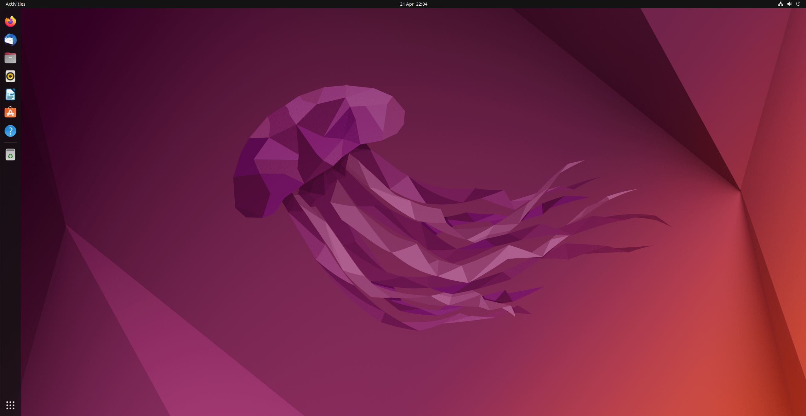

# Enterprise Security Lab 

Built a self-hosted Active Directory and security monitoring lab to better understand Windows infrastructure, SIEM pipelines, endpoint telemetry, and attack detection in a realistic enterprise scale environment.

The lab was eventually decommissioned after repeated stability and resource issues, but the process gave me hands-on experience troubleshooting authentication failures, scaling limitations, logging infrastructure, and virtualisation constraints.

---

## Environment

| Component | Purpose |
|---|---|
| Windows Server | Active Directory, DNS, DHCP |
| Windows 11 | Domain-joined endpoint |
| Ubuntu Desktop | Linux endpoint |
| Wazuh | SIEM and centralised logging |
| Security Onion | Network monitoring and IDS |
| Kali Linux | Attack simulation |

---

## What I Built

- Configured an isolated virtual network in VirtualBox
- Deployed Active Directory with DNS and DHCP
- Joined Windows endpoints to the domain
- Forwarded endpoint logs into Wazuh
- Integrated Sysmon telemetry for endpoint visibility
- Used Security Onion for network monitoring
- Simulated attacker activity from a Kali Linux host
- Investigated alerts from both endpoint and network sources

---

### Switched my host OS from Windows to Ubuntu Linux as it was lighter, smoother and I enjoyed being in the terminal

### Hardware Upgrade on my primary Lenovo laptop before completely upgrading to a MacBook Pro for more processor power.

---

## Attack Simulation

The environment was used to simulate common internal attack activity including:

- Network enumeration
- Credential attacks
- Privilege escalation
- Lateral movement
- Persistence techniques

The goal was to better understand what attacker behaviour actually looks like from a defensive monitoring perspective.

---

## What Went Wrong

This project failed multiple times before stabilising.

Main problems included:

- Elasticsearch consuming excessive memory
- DNS misconfigurations breaking Active Directory authentication
- VM clock drift causing Kerberos failures
- Security Onion and Wazuh overwhelming available resources
- CPU and RAM saturation under multi-VM workloads
- Apple Silicon migration reducing virtualisation compatibility

The biggest lesson was understanding how quickly observability and security tooling become resource-intensive in real environments. Instead of endlessly rebuilding unstable infrastructure, I decided to decommission the lab and rethink future projects using a smaller and more modular design.

---

## Key Lessons Learned

- Active Directory depends heavily on stable DNS and time synchronisation
- SIEM platforms require significant compute resources
- Security tooling scales faster than expected
- Troubleshooting distributed systems is a core engineering skill
- Smaller phased deployments are easier to maintain than large all-in-one environments
- Stability and maintainability matter as much as functionality

---

## Why I Archived The Project

The environment became too resource-heavy to maintain reliably on local hardware. Rather than continue patching instability issues, I decided to archive the lab and focus future projects around:

- cloud infrastructure
- Infrastructure-as-Code
- modular deployments
- scalable logging pipelines
- cloud-native monitoring

---

## Next Steps

The next version of this project will focus on cloud security engineering using Azure with an emphasis on:

- identity and access management
- centralised logging
- detection engineering
- Infrastructure-as-Code
- cloud-native monitoring pipelines

---

## Conclusion

This project gave me practical experience working with:

- Active Directory
- Windows and Linux systems
- SIEM monitoring
- endpoint telemetry
- network troubleshooting
- virtualisation constraints
- infrastructure reliability issues

Although the lab was eventually decommissioned, building and troubleshooting it taught me significantly more than a perfectly stable environment would have.
